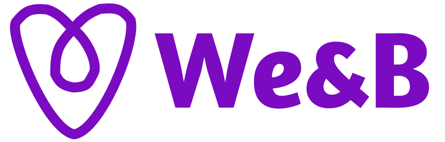

  

   

<h1 align="center">We & B</h1>
<h3 align="center"> 세계 최대 숙박 공유 서비스 Airbnb를 모티브한 팀프로젝트 </h3> 
 

- 팀 명 : 위엔비(Wenb)
- 팀 원 : 최원익(PM), 류승연, 정억화, 정예빈, 김도연, 조민지, 전은형
   

<h2 id="프로젝트소개"> :book: 프로젝트 소개</h2>

자신의 방이나 집, 별장 등 사람이 지낼 수 있는 모든 공간을 임대할 수 있는 세계 최대의 숙박 공유 서비스, 에어비앤비를 모티브로 한 프로젝트 입니다.  
기존 사이트 '에어비앤비'에서는 모티브만 가져왔을 뿐 개발은 초기 세팅부터 모두 직접 구현하였으며,
이번 프로젝트는 다양한 라이브러리와 API, 스타일 컴포넌트를 최대한 활용하는 것을 목표로 진행하였습니다.
 
 
숙박사이트를 구현하기 위해서 소셜 로그인 지원, 필터에 의한 메인페이지 숙소 랜더링, 구글맵을 통한 숙소 위치 정보 표기, 날짜를 기반으로 한 회원제 예약, 예약정보 확인 등 에어비엔비 내 핵심 기능을 모티브로 삼아서 구현하였습니다.

 

<h2 id="팀원 소개"> :dart: 개발 기간 및 팀원</h2>

- 개발 기간 : 2022/8/1 ~ 2022/8/11 (10일)
- 개발 인원 : Frontend 4명, Backend 3명
  - FE : 류승연, 정억화, 정예빈, 최원익(PM)
  - BE : 김도연, 전은형, 조민지
     

<h2 id="사용 기술"> :fork_and_knife: Skills</h2>

### Front-end

    

### Back-end

   

### 협업 툴

   
 

<h2 id="시연 영상"> :cactus: 시연 영상</h2>

[위앤비 프로젝트 시연영상](https://www.youtube.com/watch?v=btDS154C5yg)
 

<h2 id="구현목표"> :floppy_disk: 구현 목표</h2>

- 메인 페이지 (Swiper slider 라이브러리를 이용한 이미지 슬라이더 구현 및 카테고리를 탭메뉴로 구현)
- 숙소 필터링 기능 (가격, 숙소 유형, 편의시설 등 다양한 옵션을 체크함에 따라 실시간으로 옵션에 해당하는 숙소 개수 출력)
- 소셜 로그인 (카카오 REST API)을 이용한 로그인 페이지
- 구글지도 API를 활용하여 해당 페이지의 숙소목록을 지도마커로 가격이 표기되도록 구현
- 숙소 상세 페이지 (datepicker를 활용한 캘린더에서 날짜 선택 후 예약 기능 구현)
- 예약 목록 및 상세페이지 (fetch - delete 메소드를 활용하여 예약 취소 기능 구현
- Nav (지역, 날짜, 게스트 추가에 따라 해당하는 숙소 목록이 보이도록 검색 기능 구현)
   

